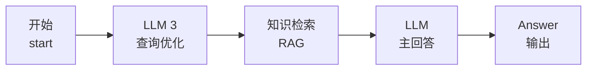

# 架构图 — 学工智答

> 所有架构图均可在 GitHub 仓库的 Markdown 预览中直接渲染。

---

## 1. 系统整体架构

```
┌─────────────────────────────────────────────────────────────────────┐
│                         用户交互层                                    │
│                                                                     │
│   🌐 Web UI (Dify Studio)    📱 移动端 (计划中)    🎙️ 语音交互      │
└──────────────────────────┬──────────────────────────────────────────┘
                           │
                           ▼
┌─────────────────────────────────────────────────────────────────────┐
│                      Dify Chatflow 编排层                            │
│                                                                     │
│  ┌─────────┐    ┌─────────┐    ┌──────────────┐    ┌────────────┐  │
│  │  开始   │───▶│ LLM 3   │───▶│ 🌟 知识检索  │───▶│    LLM     │  │
│  │(start) │    │查询优化 │    │(RAG 混合检索)│    │  主回答    │  │
│  └─────────┘    └─────────┘    └──────────────┘    └─────┬──────┘  │
│                                                          │          │
│                                                          ▼          │
│                                                     ┌─────────┐    │
│                                                     │ Answer  │    │
│                                                     └─────────┘    │
└──────────────────────────┬──────────────────────────────────────────┘
                           │
                           ▼
┌─────────────────────────────────────────────────────────────────────┐
│                       LLM 模型层（通义万相）                          │
│                                                                     │
│  qwen3.8-max (生成)  ·  qwen3-rerank (重排序)  ·  multimodal-embedding-v1 (向量化)
└──────────────────────────┬──────────────────────────────────────────┘
                           │
                           ▼
┌─────────────────────────────────────────────────────────────────────┐
│                       知识库层（Dify 管理）                           │
│                                                                     │
│  9 个知识库 · 42,846 字 · 混合检索 (keyword 0.3 + vector 0.7)       │
│                                                                     │
│  第二课堂学分  ·  发展团员流程  ·  家庭经济困难认定                   │
│  奖学金政策  ·  团委部门职能  ·  发展党员工作  ·  ...                 │
└─────────────────────────────────────────────────────────────────────┘
```

## 2. 工作流节点拓扑



**每个节点职责**：

| # | 节点 | 类型 | 职责 | 关键参数 |
|---|---|---|---|---|
| 1 | 开始 | start | 接收用户输入 | `userinput.query`, `userinput.files` |
| 2 | LLM 3 | llm | 查询优化：口语化→标准术语 + 关键词提取 | qwen3.8-max, temp=0.7 |
| 3 | 知识检索 | knowledge-retrieval | 混合检索 + 重排序 | TopK=4, qwen3-rerank |
| 4 | LLM | llm | 主回答生成：基于检索结果输出答案 | qwen3.8-max, 3084 字符提示词 |
| 5 | Answer | answer | 输出给用户 | `LLM/text` |

## 3. RAG 检索架构

```
用户提问: "贫困补助怎么拿啊？"
        │
        ▼
┌─────────────────────────────────────────┐
│  LLM 3 查询优化 (qwen3.8-max, temp=0.7) │
│                                         │
│  【主查询】家庭经济困难学生申请国家助学金 │
│           的条件和流程                   │
│  【扩展关键词】国家助学金、家庭经济困难  │
│           学生认定、助学金申请流程、     │
│           资助标准                       │
│  【政策领域】奖助学金                   │
└─────────────────────┬───────────────────┘
                      │
                      ▼
┌─────────────────────────────────────────┐
│         知识检索节点 (混合检索)           │
│                                         │
│  ┌──────────────┐   ┌──────────────┐   │
│  │ 关键词检索    │   │ 向量检索      │   │
│  │ 权重: 0.3    │   │ 权重: 0.7    │   │
│  └──────┬───────┘   └──────┬───────┘   │
│         └────────┬─────────┘           │
│                  ▼                      │
│  Top-K = 4 候选文档                     │
│                  │                      │
│                  ▼                      │
│  qwen3-rerank 重排序                    │
│                  │                      │
│                  ▼                      │
│  排序后的最终文档列表 → context          │
└─────────────────────┬───────────────────┘
                      │ context + 用户原始问题
                      ▼
┌─────────────────────────────────────────┐
│  LLM 主回答 (qwen3.8-max)                │
│                                         │
│  提示词 3084 字符:                        │
│  · 角色定位                              │
│  · 6 大回答规范                          │
│  · 助学金/奖学金强制区分规则             │
│  · 回答模板 + 错误/正确示例              │
│  · 特殊群体关怀                          │
│                                         │
│  → 生成口语化、结构化、权威的最终答案     │
└─────────────────────────────────────────┘
```

## 4. 知识库结构

```
知识库层（Dify 管理 · 9 个知识库 · 42,846 字）
│
├── 激活中（workflow 绑定）
│   ├── 第二课堂学分加分细则.md         (3 doc · 7,807 字)
│   ├── 发展团员工作流程.md              (5 doc · 16,320 字)
│   └── 家庭经济困难学生认定办法.md       (3 doc · 4,278 字)
│
└── 待激活 / 测试数据
    ├── 奖学金政策知识库.md               (2 doc · 9,386 字)
    ├── 家庭经济困难学生班级评议表.docx    (3 doc · 2,742 字)
    ├── 团委各部门职能说明.docx           (5 doc · 5,819 字)
    ├── 第二课堂学分加分细则.txt          (5 doc · 7,906 字)
    ├── 发展党员工作Ⅱ.txt                 (4 doc · 8,990 字)
    └── 英雄联盟《芸阿娜》介绍.md          (1 doc · 848 字)  ← 测试
```

## 5. 技术栈

| 组件 | 选型 | 版本/规格 |
|---|---|---|
| 平台 | Dify | Chatflow（工作流）模式 |
| 生成模型 | 通义万相 | qwen3.8-max |
| 重排序模型 | 通义万相 | qwen3-rerank |
| 向量化模型 | 通义万相 | multimodal-embedding-v1 |
| 检索模式 | 混合检索 | keyword 0.3 + vector 0.7 |
| 索引质量 | 高质量 | high_quality |
| 前端 | Dify Studio 内置 | — |

---

## 二期架构演进（规划中）

```
当前架构（MVP）                    V2 架构（规划）
─────────────────                ─────────────────
开始 → 查询优化 → 检索 → LLM     开始 → Agent 规划器
                                      ├→ 查询优化
                                      ├→ 多轮检索（动态知识图谱）
                                      ├→ 表单自动填充
                                      └→ 业务系统 API 对接
                                         ↓
                              用户：填表、申请、办手续 ← 不止是问答
```
